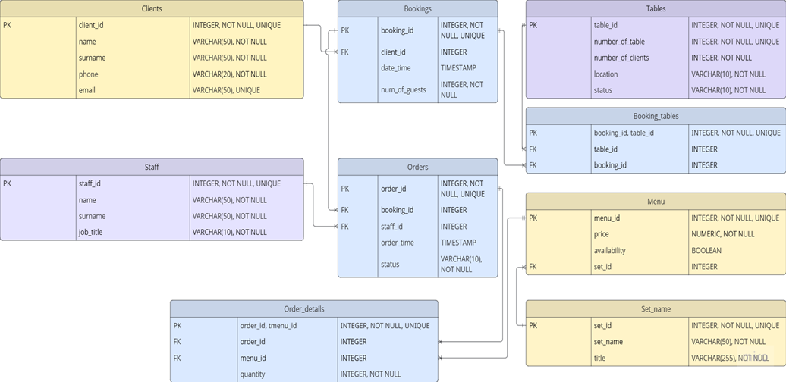

Part 1: Выбор Сценария

 Для данной работы выбран сценарий: Система бронирования в ресторане. Эта система будет управлять бронированиями клиентов, столиками, персоналом и пунктами меню.

 Part 2: Проектирование Базы Данных и Документация Идентификация Сущностей и Атрибутов:
 1. Клиенты (Clients).
2. Столы (Tables).
3. Меню (Menu).
4. Сеты (Set_name)
5. Персонал (Staff). 
6. Бронирования  (Bookings).
7. Заказы (Orders).
8. Детали заказа (Order_details).
9. Бронирование столов (Booking_tables).

Проектирование Таблиц:
1.  Table Name: Clients
○ Description: Хранит информацию о клиентах ресторана. 
○ Attributes: 
■ client_id: INTEGER, PK, NOT NULL, UNIQUE 
■ name: VARCHAR(50), NOT NULL 
■ surname: VARCHAR(50), NOT NULL
■ phone: VARCHAR(20), NOT NULL
■ email: VARCHAR(50), UNIQUE
○ Constraints: 
■ PK_Clients: PRIMARY KEY (client_id)
■ UQ_ClientsFullName: UNIQUE (name, surname) 
2.  Table Name: Tables
○ Description: Хранит информацию о столах ресторана. 
○ Attributes: 
■ table_id: INTEGER, PK, NOT NULL, UNIQUE 
■ number_of_table: INTEGER,  NOT NULL, UNIQUE
■ number_of_clients: INTEGER, NOT NULL
■ location: VARCHAR(10), NOT NULL
■ status: VARCHAR(10), NOT NULL
○ Constraints: 
■ PK_Tables: PRIMARY KEY (table_id) 
3.  Table Name: Menu
○ Description: Хранит информацию о позициях меню. 
○ Attributes: 
■ menu_id: INTEGER, PK, NOT NULL, UNIQUE 
■ price: NUMERIC, NOT NULL, CHECK (price >= 0)
■ availability: BOOLEAN
○ Constraints: 
■ PK_Menu: PRIMARY KEY (menu_id) 
■ FK_Menu_Set_name: FOREIGN KEY (set_id) REFERENCES Set_name(set_id)
4.  Table Name: Set_name
○ Description: Хранит информацию сетах меню. 
○ Attributes: 
■ set_id: INTEGER, PK, NOT NULL, UNIQUE 
■ set_name: VARCHAR(50), NOT NULL
■ title: VARCHAR(255), NOT NULL
○ Constraints: 
■ PK_Set_name: PRIMARY KEY (set_id)
5.  Table Name: Staff
○ Description: Хранит информацию о сотрудниках ресторана. 
○ Attributes: 
■ staff_id: INTEGER, PK, NOT NULL, UNIQUE 
■ name: VARCHAR(50), NOT NULL 
■ surname: VARCHAR(50), NOT NULL
■ job_title: VARCHAR(10), NOT NULL
○ Constraints: 
■ PK_Staff: PRIMARY KEY (staff_id) 
■ UQ_StaffFullName: UNIQUE (name, surname) 
6.  Table Name: Bookings
○ Description: Хранит информацию о бронированиях. 
○ Attributes: 
■ booking_id: INTEGER, PK, NOT NULL, UNIQUE 
■ client_id: INTEGER, FK 
■ date_time: TIMESTAMP
■ num_of_guests: INTEGER,  NOT NULL
○ Constraints: 
■ PK_Bookings: PRIMARY KEY (booking_id) 
■ FK_Bookings_Clients: FOREIGN KEY (client_id) REFERENCES Clients(client_id)
7.  Table Name: Orders
○ Description: Хранит информацию о заказах. 
○ Attributes: 
■ order_id: INTEGER, PK, NOT NULL, UNIQUE 
■ booking_id: INTEGER, FK 
■ staff_id: INTEGER, FK
■ order_time: TIMESTAMP
■ status: VARCHAR(10), NOT NULL
○ Constraints: 
■ PK_Orders: PRIMARY KEY (order_id) 
■ FK_Orders_Bookings: FOREIGN KEY (booking_id) REFERENCES Bookings(booking_id)
■ FK_Orders_Staff: FOREIGN KEY (staff_id) REFERENCES Staff(staff_id)
8.  Table Name: Order_details
○ Description: Таблица для реализации связи многие-ко-многим между таблицами с информацией о заказах и заказанных позициях из меню. 
○ Attributes:  
■ order_id: INTEGER, FK 
■ menu_id: INTEGER, FK
■ quantity: INTEGER, NOT NULL
○ Constraints: 
■ FK_Order¬s_order: FOREIGN KEY (order_id) REFERENCES Orders(order_id)
■ FK_Orders_menu: FOREIGN KEY (menu_id) REFERENCES Menu(menu_id)
9.  Table Name: Booking_tables
○ Description: Таблица для реализации связи многие-ко-многим между таблицами с информацией о бронировании и информацией о столиках ресторана. 
○ Attributes:  
■ table_id: INTEGER, FK 
■ booking_id: INTEGER, FK
○ Constraints: 
■ FK_Bookings_table: FOREIGN KEY (table_id) REFERENCES Tables(table_id)
■ FK_Bookings_booking: FOREIGN KEY (booking_id) REFERENCES Bookings(booking_id)

Взаимосвязи: 
● Clients и Bookings (Один-ко-Многим): один клиент может сделать множество бронирований, но каждое бронирование принадлежит только одному клиенту.
○ Bookings.client_id является внешним ключом, ссылающимся на Clients.client_id. 
● Tables и Bookings (Многие-ко-Многим): одно бронирование может быть назначено на несколько столов (в ресторане отдыхает большая компания), один стол может быть забронирован неоднократно в разное время. Реализуется при помощи таблицы Booking_tables.
○ Booking_tables.table_id является внешним ключом, ссылающимся на Tables.table_id. 
○ Booking_tables.booking_id является внешним ключом, ссылающимся на Bookings.booking_id. 
● Staff и Orders (Один-ко-Многим): один сотрудник (например, официант) может принять множество заказов, но каждый заказ принимается только одним сотрудником.
○ Orders.staff_id является внешним ключом, ссылающимся на Staff.staff_id.
● Menu  и Set_name (Один-ко-Многим): один сет (набор) может содержать много позиций меню, но каждая позиция меню принадлежит только одному сету.
○ Menu.set_id является внешним ключом, ссылающимся на Set_name.set_id.
● Bookings и Orders (Один-ко-Многим): одно бронирование может включить в себя множество заказов (несколько блюд), но каждый заказ, связанный с бронированием, относится только к одному бронированию.
○ Orders.booking_id является внешним ключом, ссылающимся на Bookings.booking_id.
● Orders и Menu (Многие-ко-Многим): один заказ может включать множество пунктов меню, один пункт меню может быть заказан во многих заказах. Реализуется при помощи таблица Orders_details.
○ Orders_details.menu_id является внешним ключом, ссылающимся на Menu.menu_id.
○ Orders_details.order_id является внешним ключом, ссылающимся на Orders.order_id.

Part 3: ER-Диаграмма
